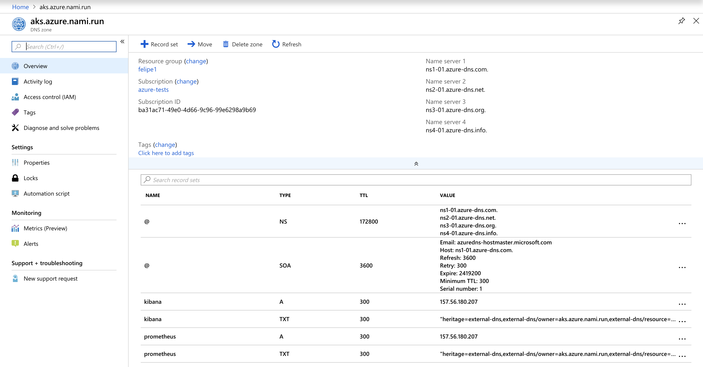
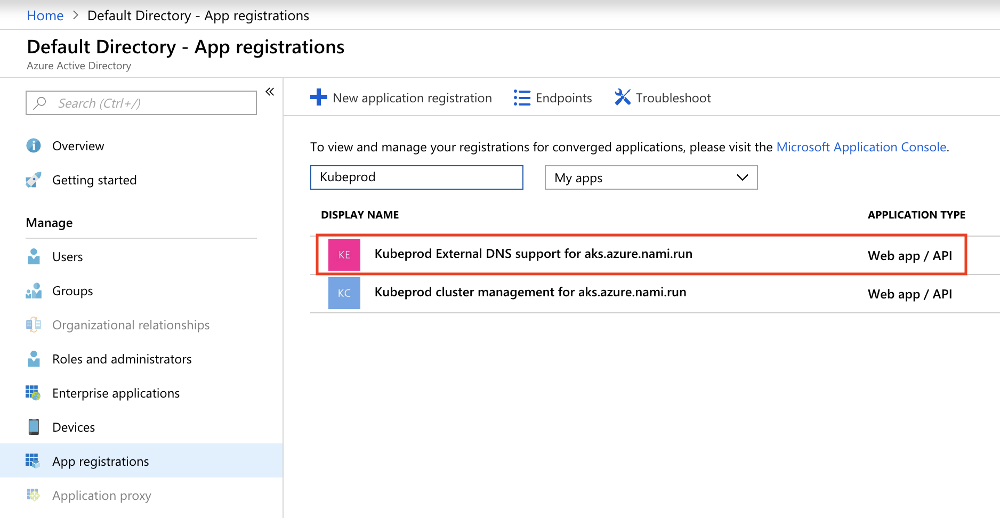
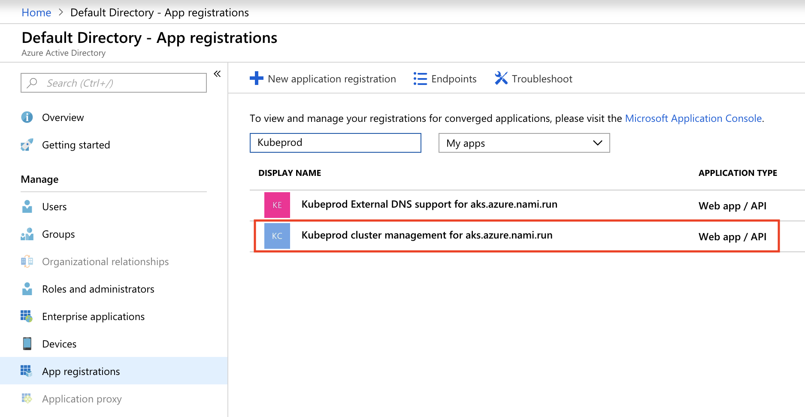

# BKPR on Azure Kubernetes Service

When `kubeprod` runs, it performs some platform-specific steps. For example, when bootstrapping BKPR in AKS (Azure Kubernetes), `kubeprod` will create some objects in Azure, namely:

* Azure DNS zone
* Azure App registration for DNS integration
* Azure App registration for Let's Encrypt integration

## Azure DNS zone

`kubeprod` provides DNS integration for Kubernetes ingress objects by means of an Azure DNS zone: every Kubernetes ingress gets a DNS entry managed automatically pointing to its external (ingress) IP address. This is accomplished by [`external-dns`](https://bitnami.com/stack/external-dns/containers).

`kubeprod install aks` requires the use of the `--dns-zone` and `--dns-resource-group` command-line flags to specify the name of the Azure DNS zone name and the name of the resource group where it shall be created. If no Azure DNS zone in this resource group exists yet, `kubeprod` will create it automatically. If an Azure DNS zone with such name already exists in this resource group, then `kubeprod` will (re)use it.

Kubernetes ingress objects will have a corresponding DNS entries created in the Azure DNS zone automatically. For example, given the following Kubernetes ingress objects:

```bash
$ kubectl -n kube-system get ingress
NAME             HOSTS                                                         ADDRESS          PORTS     AGE
kibana-logging   kibana.aks.azure.nami.run,kibana.aks.azure.nami.run           157.56.180.207   80, 443   3h
prometheus       prometheus.aks.azure.nami.run,prometheus.aks.azure.nami.run   157.56.180.207   80, 443   3h
```

The Azure DNS zone will be populated as seen in the following screen capture:



## Azure App registration for DNS integration

In order for [`external-dns`](https://bitnami.com/stack/external-dns/containers) to be able to manage DNS records in the Azure DNS zone, an Azure App registration must be created by `kubeprod` when deploying the cluster for the very first time. This object is shown on the following screen capture:



## Azure App registration for Let's Encrypt integration

Besides providing DNS integration for Kubernetes ingress, `kubeprod` also offers transparent TLS termination for ingress objects.

TLS certificates are handled transparently by `kubeprod` and, specifically, by [`cert-manager`](https://bitnami.com/stack/cert-manager/containers) and the NGINX ingress controller. Every newly-created ingress service in Kubernetes triggers `cert-manager` to request a certificate to be issued by Let's Encrypt for it. The signed X.509 certificate is then deployed and used by the NGINX controller in Kubernetes to provide TLS termination transparently. Hence, each HTTP/S request at the URL for the ingress endpoint is terminated at the NGINX ingress controller, decrypted and routed to the corresponding back-end transparently.

For this integration to work, an Azure App registration must be created by `kubeprod` when deploying the cluster for the very first time. This object is shown on the following screen capture:


