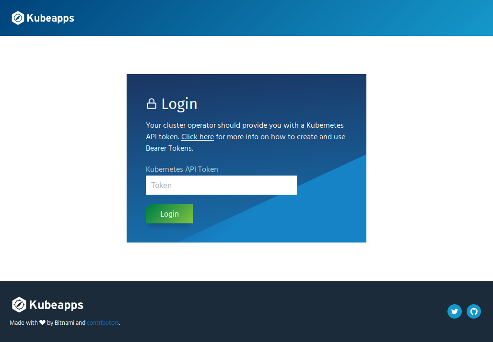
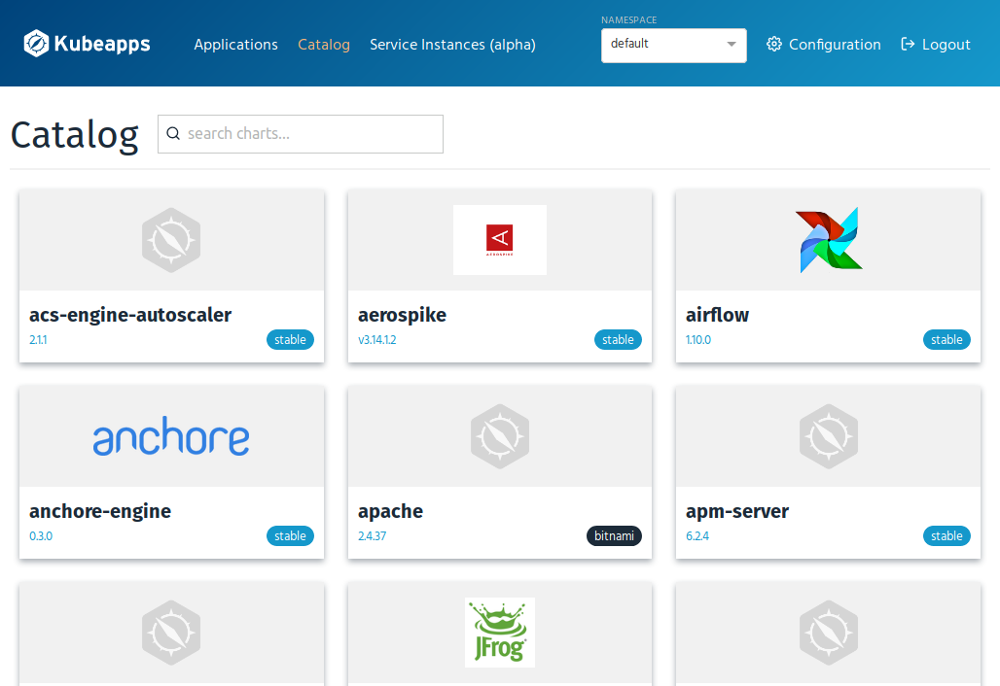

# Installing Kubeapps on BKPR

This guide documents the installation of [Kubeapps](https://kubeapps.com/) on the Kubernetes Production Runtime (BKPR) cluster. You will first install the [Helm](https://www.helm.sh/) package manager to the cluster, followed by the installation of Kubeapps using the [Kubeapps Helm chart](https://hub.kubeapps.com/charts/bitnami/kubeapps).

The guide assumes you have a Kubernetes cluster with BKPR already installed. The [BKPR installation guide](install.md) documents the process of installing the BKPR client, followed by installing the BKPR server side components on the cluster.

## Step 1: Install the Helm client

Follow the instructions in the [Helm installation guide](https://docs.helm.sh/using_helm/#installing-the-helm-client) to install the latest release of the Helm binary to your machine.

## Step 2: Install Tiller securely

Tiller is the server-side component of Helm that runs inside your Kubernetes cluster. Follow the Helm documentation to [configure role-based access control](https://docs.helm.sh/using_helm/#role-based-access-control) and [install Tiller securely to the cluster](https://docs.helm.sh/using_helm/#using-ssl-between-helm-and-tiller).

## Step 3: Install Kubeapps

Kubeapps is a open-source web-based UI for deploying and managing applications in Kubernetes clusters. It provides you with a dashboard to:

    - Browse Helm charts from public or your own private chart repositories and deploy them to your cluster
    - Upgrade, manage and delete the applications that are deployed in your cluster
    - Browse and provision external services from the Service Catalog

Kubeapps can be installed using the [Kubeapps Helm chart](https://hub.kubeapps.com/charts/bitnami/kubeapps) from the official [Bitnami charts repository](https://github.com/bitnami/charts).

Begin by configuring the Helm client to use the Bitnami charts repository.

```bash
helm repo add bitnami https://charts.bitnami.com/bitnami
```

Install Kubeapps on your Kubernetes cluster with the following command:

```bash
helm install --tls \
  --name kubeapps --namespace kubeapps \
  --set tillerProxy.tls.ca="$(cat ca.cert.pem)" \
  --set tillerProxy.tls.key="$(cat helm.key.pem)" \
  --set tillerProxy.tls.cert="$(cat helm.cert.pem)" \
  --set ingress.enabled=true \
  --set ingress.certManager=true \
  --set ingress.hosts[0].name=kubeapps.[YOUR-BKPR-ZONE] \
  --set ingress.hosts[0].tls=true \
  --set ingress.hosts[0].tlsSecret=kubeapps-tls \
  --set mongodb.metrics.enabled=true \
  bitnami/kubeapps
```

The command line flags provided in the above command enable the Ingress resource in the Kubeapps chart and also enable TLS support. Once installed, you will be able to generate an access token and then access the Kubeapps dashboard securely (HTTPS) over the Internet at `https://kubeapps.[YOUR-BKPR-ZONE]`.

_Please replace the placeholder string `[YOUR-BKPR-ZONE]` in the above command with the DNS zone configured while setting up BKPR in your Kubernetes cluster._

Kubeapps requires users to login before making requests.  However, if you would not like the dashboard to be accessible externally over the Internet, please disable the Ingress support while installing the chart.  If Ingress is disabled, you need to follow the Kubeapps post-install instructions to access the dashboard using a proxy connection to the cluster.

The chart parameter `mongodb.metrics.enabled=true` in the above command enables the Prometheus exporter for MongoDB in the Kubeapps chart.

> **Tip**:
>
> When installing applications on your cluster, remember to enable Prometheus exporters in applications that support them. The exported instrumentation data will be automatically scrapped by the Prometheus server installed in the cluster by BKPR and will provide useful insights into the cluster's performance. Refer to the [Monitoring stack](components.md#monitoring-stack) documentation to learn more.

## Step 4: Generate an access token

The Kubeapps dashboard will prompt you to provide a access token before allowing you to make any changes to the Kubernetes cluster. For the purpose of this guide you will generate a super-user access token using the commands listed below. Refer to the [Access Control in Kubeapps](https://github.com/kubeapps/kubeapps/blob/master/docs/user/access-control.md) document to learn about specifying access privileges for users of the dashboard.



```bash
kubectl create serviceaccount kubeapps-operator
kubectl create clusterrolebinding kubeapps-operator \
  --clusterrole=cluster-admin \
  --serviceaccount=default:kubeapps-operator
```

Get the value of the generated access token with:

```bash
kubectl get secret -o jsonpath='{.data.token}' \
    $(kubectl get serviceaccount kubeapps-operator -o jsonpath=' {.secrets[].name}') \
    | base64 --decode
```

You should now be able to login to the Kubeapps dashboard using the displayed access token and install applications to the cluster using the available Helm charts or by adding your own private Helm chart repositories. Refer to the [Kubeapps User Documentation](https://github.com/kubeapps/kubeapps/tree/master/docs/user) to learn more about Kubeapps and its offerings.



## Further reading

- [BKPR FAQ](FAQ.md)
- [Application Developer's Reference Guide](application-developers-reference-guide.md)
- [Get Started with Kubeapps](https://github.com/kubeapps/kubeapps/blob/master/docs/user/getting-started.md)
- [Securing Kubeapps installation](https://github.com/kubeapps/kubeapps/blob/master/docs/user/securing-kubeapps.md)
