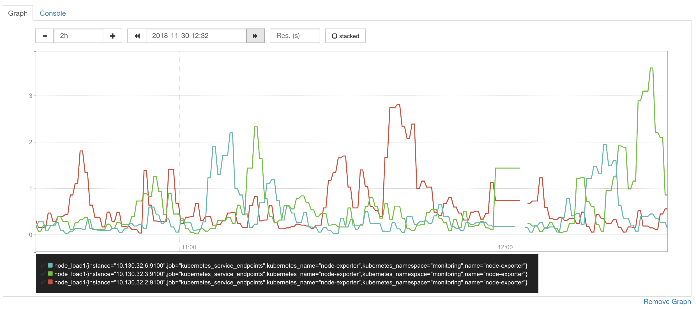

# Prometheus Time Series Database Migration

If you already have a running Kubernetes cluster and you are interestd on installing the Bitnami Kubernetes Production Runtime (BKPR) on it you may want to migrate the persisted data of your current services to the ones installed by BKPR. In this case, we will talk about the Prometheus Time Series Data Base (TSDB), which contains the metrics that Prometheus scrapped from your services.

This document describes the steps to migrate the TSDB from an existing Prometheus deployment to the one installed by BKPR.

Furthermore, this process will not generate any downtime for your current Prometheus deployment, making it safe to be followed.

## Prerequisites

The following prerequisites should be met before starting with the migration process:

* You have a healthy Kubernetes cluster running.
* You have a Prometheus deployment that *matches the BKPR Prometheus version*, which can be obtained [here](https://github.com/bitnami/kube-prod-runtime#release-compatibility).

This article will not cover the upgrade process of Prometheus itself. If you need to update your Prometheus deployment, check the [Prometheus docs](https://prometheus.io/docs/prometheus/latest/migration/)

## Overview

This section provides an overview of the required steps to migrate the Prometheus TSDB from an already running deployment to the BKPR Prometheus one.

This process has been designed and tested to ensure the shortest possible downtime when migrating to the new StatefulSet by having two Prometheus instances running at the same time. These instances will be modified to include a sidecar container that will deploy an *rsync* client and server with access to the Prometheus data volume in order to move a Prometheus TSDB snapshot from one pod to another.

As Prometheus doesn’t include yet a *flush* method to dump the WAL file that is being written into a snapshot with a block format that doesn’t overlap time ranges (see [this issue](https://github.com/prometheus/tsdb/issues/346) for more context) it is necessary to sync with the Prometheus TSDB compaction times, in order to ensure a minimal data loss (less than 5 minutes).

These are the steps required to perform this migration:

* Deploy an rsync server-side container (acting as the rsync server) in your current Prometheus deployment 
* Modify the `kubeprod-manifest.jsonnet` file to add another sidecar rsync container (acting as a client)
* Sync with the compaction times of the Prometheus database
* Perform the snapshot and restore it in the new deployment
* Check next TSDB compacts

## Step 1: Deploy the sidecar rsync server-side container

In order to access the Prometheus TSDB snapshots using *rsnyc*, it will be necessary to deploy an *rsync* server with a minimal configuration.

You can use the following Jsonnet snippet to add that sidecar container:

```jsonnet
// target-add-rsync.jsonnet: add rsync sidecar container, exposing
// <volume_name> below via rsync, by overloading saved "target.json"

// NOTE: We're not assuming a particular instrumentation tool (e.g ksonnet, kubecfg via jsonnet)
// but rather doing an override from original sts / deploy output json

// 1) Save existing deployment/sts to target.json:
//   kubectl get deployments -n NAMESPACE NAME -o target.json
local target = import "target.json";

// volume_name must be the name of existing volume name inside target's podSpec
local volume_name = "data";

// 2) show/diff/update resulting composition ('-J lib' where lib is the path to kube.libsonnet)
//   kubecfg -J lib show target-add-rsync.jsonnet

// For testing purposes, You can fake above by creating a deploy with an emptyDir volume:
//    kubectl run --image=nginx:latest --overrides '{"spec":{"template":{"spec":{ "volumes": [{"name": "data", "emptyDir": {}}]}}}}' nginx-tgt
//    kubectl get deploy nginx-tgt -ojson > target.json

local kube = import "./kube.libsonnet";
local prometheus_container_name = "prometheus";

local rsync_conf_b64 = std.base64(
  |||
    [data]
    path = /data
    list = false
    use chroot = false
    read only = true
  |||
);

local rsync_container_name = "sidecar-rsync";

// sidecar-rsync container (mounting <volume_name>) to be exposed via rsync
local rsync_container = kube.Container(rsync_container_name) {
  image: "alpine:3.8",
  args: [
    "sh",
    "-c",
    |||
      apk update && apk add rsync curl
      echo '%s' | base64 -d > /rsync.conf
      rsync -vvv --daemon --no-detach --config=/rsync.conf
    ||| % [rsync_conf_b64],
  ],
  volumeMounts_+: {
    [volume_name]: { mountPath: "/data" },
  },
};

local containers_obj(containers) = {
  [container.name]: container for container in containers
};

local stack = {
  
  target_with_sidecar: target {
    spec+: {
      template+: {
        spec+: {
          // convert containers array to obj for easier jsonnet
          // handling: in particular, if we just added the new container
          // to existing containers[] array, we wouldn't be able to re-run
          // this, as we'd get duplicated containers.
          // By referring the added container via rsync_container_name, we
          // can easily override it.

          local containers = super.containers,
          containers: kube.PodSpec {
            default_container:: containers[0].name,
            // create or override(existing) rsync_container
            containers_+: containers_obj(containers) {
              [rsync_container_name]: rsync_container,
              [prometheus_container_name]+:{
                args+: [
                  "--web.enable-admin-api",
                ],
              },
            },
          }.containers,
        },
      },
    },
  },
};

kube.List() {items_+: stack}
```

Note  how one extra argument has been added to the Prometheus container. In order to generate a snapshot of Prometheus it is mandatory to have the admin API enabled. Take a look at the [Prometheus docs](https://prometheus.io/docs/prometheus/latest/querying/api/#tsdb-admin-apis) for more information about this.

After deploying the generated manifest you will have a rsync container that you can access with:

`kubectl exec -it -n NAMESPACE PROMETHEUS_POD_NAME -c sidecar-rsync sh`

> Note: Make sure you change the placeholders NAMESPACE and PROMETHEUS_POD_NAME for the Kubernetes namespace and Prometheus pod name you have. For example: `kubectl exec -it -n monitoring prometheus-d776d68fb-vc7gt -c sidecar-rsync sh`

Check also that a new service has been created for Prometheus, as shown in the example command and output below:

```bash
~ $ kubectl get svc -n NAMESPACE
NAME               TYPE        CLUSTER-IP      EXTERNAL-IP   PORT(S)    AGE
prometheus         ClusterIP   10.30.244.231   <none>        9090/TCP   1y
prometheus-rsync   ClusterIP   10.30.247.115   <none>        873/TCP    9d
```

> Note: Make sure you change the NAMESPACE placeholder for the one where your Prometheus deployment lives.

Now, you should be able to access the `prometheus-rsync` from other pod. You can do a quick test from other pod you can do:

```bash
/ # nc -zv prometheus-rsync.NAMESPACE.svc.cluster.local 873
prometheus-rsync.NAMESPACE.svc.cluster.local (10.130.32.5:873) open
```

## Step 2: Modify the `kubeprod-manifest.jsonnet` file to add the rsync client-side container

The `kubeprod-manifest.jsonnet` file contains all the custom configuration you want to apply to the jsonnet manifests.  In this case, in order to add the rsync client-side container, include the following configuration:

```jsonnet
// Bitnami specific common configuration
local common_prom_config = import "../common/prometheus/conf.d/prometheus.jsonnet";

// Common libs
local kube = import "kube.libsonnet";

(import "../vendor/kubeprod/manifests/platforms/gke.jsonnet") {

  config:: import "kubeprod-autogen.json",

  // Place your overrides here
  prometheus+: { 

    // Add rsync sidecar container to the prometheus sts.
    // and adapt resources to our needs
    prometheus+: {  // Prometheus server itself
      deploy+: {  // Prometheus StatefulSet deployment
        spec+: {
          template+: {
            spec+: {
              containers_+: {
                rsync: kube.Container("sidecar-rsync") {
                  image: "alpine:3.8",
                  args+: ["sh", "-c", "apk update && apk add rsync curl && tail -f /dev/null"],
                  volumeMounts_+: {
                    data: { mountPath: "/data" },
                  },
                },
              },
            },
          },
        },
      },
    },
  },
}
```

Deploy the manifests in the cluster with:

```bash
kubecfg update kubeprod-manifest.jsonnet
```

Now, you can check that the Prometheus pod have 3 containers:

```bash
~ $ kubectl get pods -o=jsonpath='{range .items[*]}{"\n"}{.metadata.name}{":\t"}{range .spec.containers[*]}{.image}{", "}{end}{end}' | grep prometheus |\
sort

prometheus-0:	bitnami/prometheus:2.4.3-r31, jimmidyson/configmap-reload:v0.2.2, alpine:3.8,
```

## Step 3: Sync with the compacton times of the Prometheus TSDB

> Note: Check the available space in the Prometheus volume before doing any snapshot to avoid unexpected issues with free disk space.

Now that all bits are in place you are ready to perform the Prometheus TSDB migration. To do so, you will first have to understand how the Prometheus compaction process works and how to sync with compaction times to minimize data loss.

By default, each two hours Prometheus will compact the TSDB and will write to disk the latest information it has in the WAL (Write-Ahead-Log) file. You can watch the compaction process through the Prometheus logs. A small sample of the relevant log lines is shown below:

```bash
level=info ts=2018-12-05T07:00:08.164203448Z caller=compact.go:398 component=tsdb msg="write block" mint=1543982400000 maxt=1543989600000 ulid=01CXYJN992AVWSVVJFP6X4E8MR
level=info ts=2018-12-05T07:00:09.142253971Z caller=head.go:446 component=tsdb msg="head GC completed" duration=183.072583ms

level=info ts=2018-12-05T09:00:08.289897499Z caller=compact.go:398 component=tsdb msg="write block" mint=1543989600000 maxt=1543996800000 ulid=01CXYSH0M8RSWNJG3YM1S9YGY5
level=info ts=2018-12-05T09:00:09.242667991Z caller=head.go:446 component=tsdb msg="head GC completed" duration=170.063092ms
```

You can see how the delta between those two compacts is two hours.

In order to do a safe migration and avoid time range overlaps in later compactions, it is necessary to create a snapshot in Prometheus skipping the WAL file, as it contains references to future time ranges.

It is important to know that if you create a Prometheus snapshot skipping the WAL file the **last hour of data** will not be present in the snapshot. For example, if the Prometheus logs show the following operations:

```bash
level=info ts=2018-12-05T11:00:08.289897499Z caller=compact.go:398 component=tsdb msg="write block" mint=1543989600000 maxt=1543996800000 ulid=01CXYSH0M8RSWNJG3YM1S9YGY5
level=info ts=2018-12-05T13:00:09.242667991Z caller=head.go:446 component=tsdb msg="head GC completed" duration=170.063092ms
```

A good time to create a snapshot of the TSDB  to perform the migration would be at 13:01 UTC, so you create the snapshot just after Prometheus wrote the latest information stored in the WAL file to disk.
If you do this, you will find the following:

[Insert image of  Prometheus query with 1 hour of missing data due to snapshot]

This way you would have lost 1 hour of Prometheus metrics.

In order to ensure a minimal data loss, the new Prometheus deployment should be deployed 55 mins (ensuring with this less than 5 mins of data loss) before the next TSDB compact happens, so the new Prometheus deployment can start scraping data before the snapshot is restored. Continuing with the last example:

If the next TSDB compact happens at 13:00 UTC you should deploy BKPR Prometheus in the cluster at 12:05 UTC, so Prometheus can start scraping data and fill the gap that the snapshot will create. Then, at 13:00 UTC you can create the Prometheus snapshot and will restore it in the new deployment, creating the following:



## Step 4: Perform the Prometheus TSDB migration

Now that the process has been explained in detail, these are the commands that will have to be executed in order to migrate the TSDB from the old Prometheus deployment to the BKPR one.

After a previous sync with the TSDB, the command to generate the Prometheus snapshot is:

`curl -XPOST http://localhost:9090/api/v1/admin/tsdb/snapshot?skip_head=true`

That command is meant to be executed from the sidecar rsync container that is deployed in the old Prometheus deployment. As soon as you execute that command, the snapshot will be stored under the data directory of Prometheus, under `snapshots/`.

Once the snapshot is done, connect to the sidecar rsync container in the new Prometheus deployment and execute:

`rsync -avrP prometheus-rsync.NAMESPACE.svc.cluster.local::data/snapshots/ /opt/bitnami/prometheus/data/`

> Note:  Make sure you change the NAMESPACE placeholder for the Kubernetes namespace where the old Prometheus deployment lives.

After the rsync has finished, move the block directories to the main data folder of Prometheus. This an example of the structure you will find data directory of the new Prometheus deployment:

```bash
/data # ls -la
total 96
drwxrwsr-x   24 1001     1001          4096 Dec  5 11:00 .
drwxr-xr-x    1 root     root          4096 Nov 30 13:02 ..
drwxrwsr-x    3 1001     1001          4096 Nov 30 13:00 01CTTC16QP4NCPRM28H7Y6HXWB
drwxrwsr-x    3 1001     1001          4096 Nov 30 13:00 01CV05DT3E6QKSEMR2TAEEYWTQ
drwxrwsr-x    3 1001     1001          4096 Nov 30 13:00 01CV5YTF6Z4F22DJ5ECNM4PAH9
drwxrwsr-x    3 1001     1001          4096 Nov 30 13:00 01CVBR71YE4M97K3SDXXQ9449W
drwxrwsr-x    3 1001     1001          4096 Nov 30 13:00 01CVHHKMAEH0A0WP7BSYCKDTST
drwxrwsr-x    3 1001     1001          4096 Nov 30 13:00 01CVQB0GF1153DSTGSQ8HJ82KF
drwxrwsr-x    3 1001     1001          4096 Nov 30 13:00 01CVX4CTZJ8VDVS2PQKQQYZVRN
drwxrwsr-x    3 1001     1001          4096 Nov 30 13:00 01CW2XSE758NYFKWY2AX3ZGRMY
drwxrwsr-x    3 1001     1001          4096 Nov 30 13:00 01CW8Q6AZPZKD10ZFFNP102V4Z
drwxrwsr-x    3 1001     1001          4096 Nov 30 13:00 01CWEGJQ52W2YJXZ86J51FJGBP
drwxrwsr-x    3 1001     1001          4096 Nov 30 13:00 01CWM9ZAP7SBZBXQJPT4409PE6
drwxrwsr-x    3 1001     1001          4096 Nov 30 13:00 01CWT3C1RRY2SEZT93AX0EFYW0
-rw-rw-r--    1 1001     1001             0 Nov 30 12:05 lock
drwxrwsr-x    3 1001     1001          4096 Dec  5 12:01 wal
```

Now, delete the Prometheus pod to force a reload of all the TSDB blocks with:

`kubectl delete pod prometheus-0 -n kubeprod --grace-period=0`

In the next start

```bash
level=info ts=2018-11-30T13:02:09.537050487Z caller=main.go:238 msg="Starting Prometheus" version="(version=2.4.3, branch=HEAD, revision=167a4b4e73a8eca8df648d2d2043e21bdb9a7449)"
level=info ts=2018-11-30T13:02:09.537122788Z caller=main.go:239 build_context="(go=go1.11.1, user=root@1e42b46043e9, date=20181004-08:42:02)"
level=info ts=2018-11-30T13:02:09.537142375Z caller=main.go:240 host_details="(Linux 4.14.65+ #1 SMP Sun Sep 9 02:18:33 PDT 2018 x86_64 prometheus-0 (none))"
level=info ts=2018-11-30T13:02:09.537159771Z caller=main.go:241 fd_limits="(soft=1048576, hard=1048576)"
level=info ts=2018-11-30T13:02:09.537173945Z caller=main.go:242 vm_limits="(soft=unlimited, hard=unlimited)"
level=info ts=2018-11-30T13:02:09.54195241Z caller=main.go:554 msg="Starting TSDB ..."
level=info ts=2018-11-30T13:02:09.542280702Z caller=web.go:397 component=web msg="Start listening for connections" address=0.0.0.0:9090
level=info ts=2018-11-30T13:02:09.557987841Z caller=repair.go:35 component=tsdb msg="found healthy block" mint=1540425600000 maxt=1540620000000 ulid=01CTTC16QP4NCPRM28H7Y6HXWB
level=info ts=2018-11-30T13:02:09.566754786Z caller=repair.go:35 component=tsdb msg="found healthy block" mint=1540620000000 maxt=1540814400000 ulid=01CV05DT3E6QKSEMR2TAEEYWTQ
level=info ts=2018-11-30T13:02:09.566884665Z caller=repair.go:35 component=tsdb msg="found healthy block" mint=1540814400000 maxt=1541008800000 ulid=01CV5YTF6Z4F22DJ5ECNM4PAH9
level=info ts=2018-11-30T13:02:09.566960934Z caller=repair.go:35 component=tsdb msg="found healthy block" mint=1541008800000 maxt=1541203200000 ulid=01CVBR71YE4M97K3SDXXQ9449W
level=info ts=2018-11-30T13:02:09.567034354Z caller=repair.go:35 component=tsdb msg="found 
...
level=info ts=2018-11-30T13:02:17.548873548Z caller=main.go:564 msg="TSDB started"
```

The migration is finished, you now can execute some queries in Prometheus to check that you can gather data from your backup.

## Step 5: Check next TSDB compacts

In order to ensure the the migration took place correctly and the new Prometheus TSDB is healthy and stable, you should check the Prometheus logs after several TSDB compacts.

Several hours after the migration, the Prometheus logs should keep showing healthy TSDB compacts:

```bash
level=info ts=2018-12-05T09:00:09.242667991Z caller=head.go:446 component=tsdb msg="head GC completed" duration=170.063092ms
level=info ts=2018-12-05T09:00:12.199252153Z caller=compact.go:352 component=tsdb msg="compact blocks" count=3 mint=1543968000000 maxt=1543989600000 ulid=01CXYSH4GP082JQ2XV1BFVBTQF sources="[01CXY4XTS831KC5DQGV1JGGTSW 01CXYBSJ4AWC7VBTNRS8PDS2DT 01CXYJN992AVWSVVJFP6X4E8MR]"
level=info ts=2018-12-05T09:00:17.644297906Z caller=compact.go:352 component=tsdb msg="compact blocks" count=3 mint=1543924800000 maxt=1543989600000 ulid=01CXYSH84VSA76W9PH93DXVA8G sources="[01CXXGAS4NBKWYEQ98YN29BTAK 01CXY4XYZ0CDC5P098SXE8451B 01CXYSH4GP082JQ2XV1BFVBTQF]"
level=info ts=2018-12-05T11:00:08.869779513Z caller=compact.go:398 component=tsdb msg="write block" mint=1543996800000 maxt=1544004000000 ulid=01CXZ0CQZMCZM7MMX8SZ6GVVRW
level=info ts=2018-12-05T11:00:09.952061917Z caller=head.go:446 component=tsdb msg="head GC completed" duration=178.552891ms
```

It is good practice to leave the old Prometheus database running until you are satisfied that the migration has completed without errors.