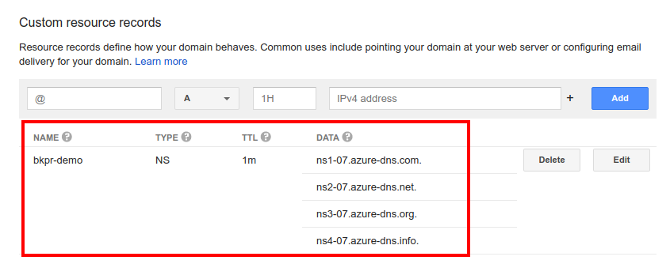

# Quickstart: BKPR on Azure Kubernetes Service (AKS)

## TOC

- [Introduction](#introduction)
- [Prerequisites](#prerequisites)
- [Installation and setup](#installation-and-setup)
- [Next steps](#next-steps)
  + [Installing Kubeapps on BKPR](kubeapps-on-bkpr.md)
- [Upgrading](#upgrading)
- [Teardown and cleanup](#teardown-and-cleanup)
- [Further reading](#further-reading)

## Introduction

This document walks you through setting up an Azure Kubernetes Service (AKS) cluster and installing the Bitnami Kubernetes Production Runtime (BKPR) on it.

## Prerequisites

* [Microsoft Azure account](https://azure.microsoft.com)
* [Microsoft Azure CLI](https://docs.microsoft.com/en-us/cli/azure/install-azure-cli?view=azure-cli-latest)
* [Kubernetes CLI](https://kubernetes.io/docs/tasks/tools/install-kubectl/)
* [BKPR installer](install.md)
* [kubecfg](https://github.com/ksonnet/kubecfg/releases)
* [jq](https://stedolan.github.io/jq/)

### DNS requirements

In addition to the requirements listed above, a domain name is also required for setting up Ingress endpoints to services running in the cluster. The specified domain name can be a top-level domain (TLD) or a subdomain. In either case you have to manually [set up the NS records](#step-3-configure-domain-registration-records) for the specified TLD or subdomain so as to delegate DNS resolution queries to an Azure DNS zone created and managed by BKPR.  This is required in order to generate valid TLS certificates.

## Installation and setup

### Step 1: Set up the cluster

In this section, you will deploy an Azure Kubernetes Service (AKS) cluster using the Azure CLI.

* Log in to your Microsoft Azure account by executing `az login` and follow the onscreen instructions.

* Configure the following environment variables:

  ```bash
  export BKPR_DNS_ZONE=my-domain.com
  export AZURE_USER=$(az account show --query user.name -o tsv)
  export AZURE_SUBSCRIPTION_ID=xxxxxxxxx-xxxx-xxxx-xxxx-xxxxxxxxxxxx
  export AZURE_REGION=eastus
  export AZURE_RESOURCE_GROUP=my-kubeprod-group
  export AZURE_AKS_CLUSTER=my-aks-cluster
  export AZURE_AKS_K8S_VERSION=1.11.5
  ```

  - `BKPR_DNS_ZONE` specifies the DNS suffix for the externally-visible websites and services deployed in the cluster.
  - `AZURE_USER` specifies the email address used in requests to Let's Encrypt.
  - `AZURE_SUBSCRIPTION_ID` specifies the Azure subscription id. `az account list -o table` lists your Microsoft Azure subscriptions.
  - `AZURE_REGION` specifies the Azure region code.
  - `AZURE_RESOURCE_GROUP` specifies the name of the Azure resource group in which resources should be created.
  - `AZURE_AKS_CLUSTER` specifies the name of the AKS cluster.
  - `AZURE_AKS_K8S_VERSION` specifies the version of Kubernetes to use for creating the cluster. The [BKPR Kubernetes version support matrix](../README.md#kubernetes-version-support-matrix-for-bkpr-10) lists the base Kubernetes versions supported by BKPR. `az aks get-versions --location ${AZURE_REGION} -o table` lists the versions available in your region.

* Set the default subscription account:

  ```bash
  az account set --subscription ${AZURE_SUBSCRIPTION_ID}
  ```

* Create the resource group for AKS:

  ```bash
  az group create --name ${AZURE_RESOURCE_GROUP} --location ${AZURE_REGION}
  ```

* Create the AKS cluster:

  ```bash
  az aks create \
    --resource-group "${AZURE_RESOURCE_GROUP}" \
    --name "${AZURE_AKS_CLUSTER}" \
    --kubernetes-version ${AZURE_AKS_K8S_VERSION} --verbose
  ```

  Provisioning a AKS cluster can take a long time to complete. Please be patient while the request is being processed.

* Configure `kubectl` to use the new cluster:

  ```bash
  az aks get-credentials \
    --resource-group "${AZURE_RESOURCE_GROUP}" \
    --name "${AZURE_AKS_CLUSTER}" \
    --overwrite-existing
  ```

* Verify that your cluster is up and running:

  ```bash
  kubectl get nodes
  ```

### Step 2: Deploy BKPR

To bootstrap your Kubernetes cluster with BKPR:

  ```bash
  kubeprod install aks \
    --email ${AZURE_USER} \
    --dns-zone "${BKPR_DNS_ZONE}" \
    --dns-resource-group "${AZURE_RESOURCE_GROUP}"
  ```

Wait for all the pods in the cluster to enter `Running` state:

  ```bash
  kubectl get pods -n kubeprod
  ```

### Step 3: Configure domain registration records

BKPR creates and manages a DNS zone which is used to map external access to applications and services in the cluster. However, for it to be usable, you need to configure the NS records for the zone.

Query the name servers of the zone with the following command and configure the records with your domain registrar.

  ```bash
  az network dns zone show \
    --name ${BKPR_DNS_ZONE} \
    --resource-group ${AZURE_RESOURCE_GROUP} \
    --query nameServers -o tsv
  ```

The following screenshot illustrates the NS record configuration on a DNS registrar when a subdomain is used.



Please note, it can take a while for the DNS changes to propagate.

### Step 4: Access logging and monitoring dashboards

After the DNS changes have propagated, you should be able to access the Prometheus and Kibana dashboards by visiting `https://prometheus.${BKPR_DNS_ZONE}` and `https://kibana.${BKPR_DNS_ZONE}` respectively.

Congratulations! You can now deploy your applications on the Kubernetes cluster and BKPR will help you manage and monitor them effortlessly.

## Next steps

- [Installing Kubeapps on BKPR](kubeapps-on-bkpr.md)

## Upgrading

### Step 1: Update the installer

Follow the [installation guide](install.md) to update the BKPR installer binary to the latest release.

### Step 2: Edit `kubeprod-manifest.jsonnet`

Edit the `kubeprod-manifest.jsonnet` file that was generated by `kubeprod install` and update the version referred in the `import` statement. For example, the following snippet illustrates the changes required in the `kubeprod-manifest.jsonnet` file if you're upgrading to version `v1.1.0` from version `v1.0.0`.

```diff
 // Cluster-specific configuration
-(import "https://releases.kubeprod.io/files/v1.0.0/manifests/platforms/aks.jsonnet") {
+(import "https://releases.kubeprod.io/files/v1.1.0/manifests/platforms/aks.jsonnet") {
  config:: import "kubeprod-autogen.json",
  // Place your overrides here
 }
```

### Step 3: Perform the upgrade

Re-run the `kubeprod install` command, from the [Deploy BKPR](#step-2-deploy-bkpr) step, in the directory containing the existing `kubeprod-autogen.json` and updated `kubeprod-manifest.jsonnet` files.

## Teardown and cleanup

### Step 1: Uninstall BKPR from your cluster

  ```bash
  kubecfg delete kubeprod-manifest.jsonnet
  ```

### Step 2: Delete the Azure DNS zone

  ```bash
  az network dns zone delete \
    --name ${BKPR_DNS_ZONE} \
    --resource-group ${AZURE_RESOURCE_GROUP}
  ```

  Additionally you should remove the NS entries configured at the domain registrar.

### Step 3: Delete Azure app registrations

  ```bash
  az ad app delete \
    --subscription ${AZURE_SUBSCRIPTION_ID} \
    --id $(jq -r .externalDns.aadClientId kubeprod-autogen.json)
  az ad app delete \
    --subscription ${AZURE_SUBSCRIPTION_ID} \
    --id $(jq -r .oauthProxy.client_id kubeprod-autogen.json)
  ```

### Step 4: Delete the AKS cluster

  ```bash
  az aks delete \
    --name ${AZURE_AKS_CLUSTER} \
    --resource-group ${AZURE_RESOURCE_GROUP}
  ```

### Step 5: Delete the Azure resource group

  ```bash
  az group delete --name ${AZURE_RESOURCE_GROUP}
  ```

## Further reading

- [BKPR FAQ](FAQ.md)
- [Troubleshooting](troubleshooting.md)
