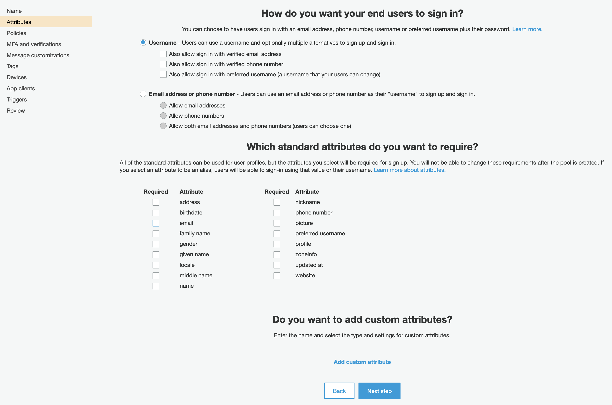
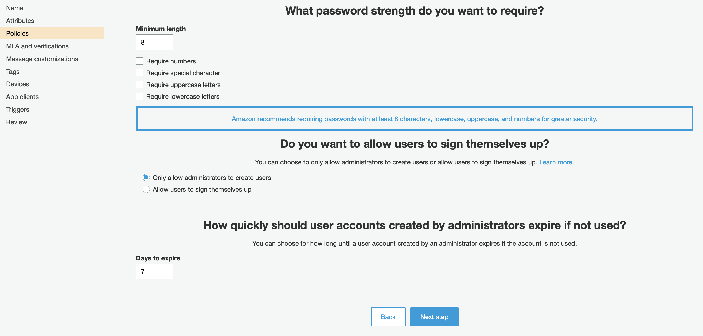
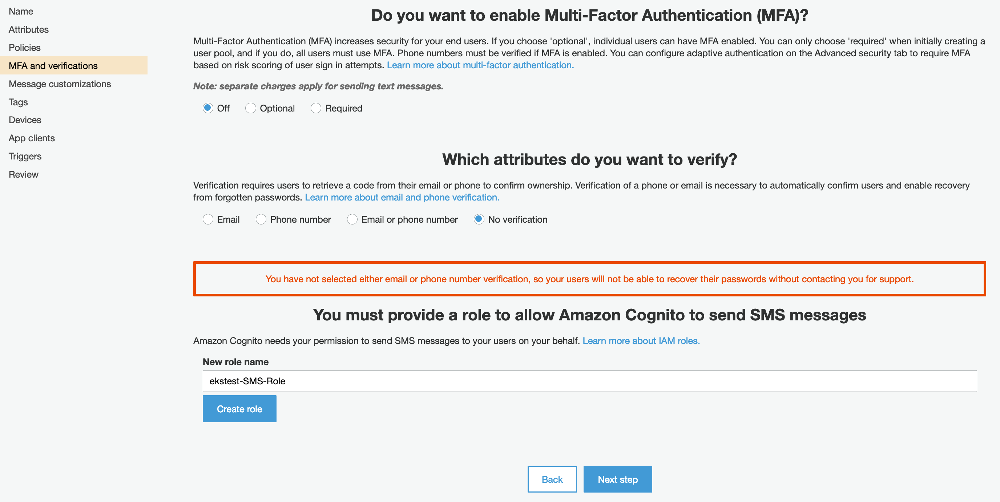
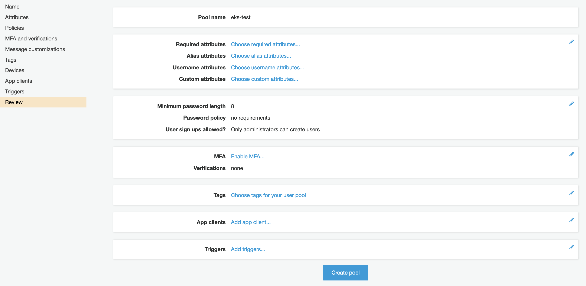
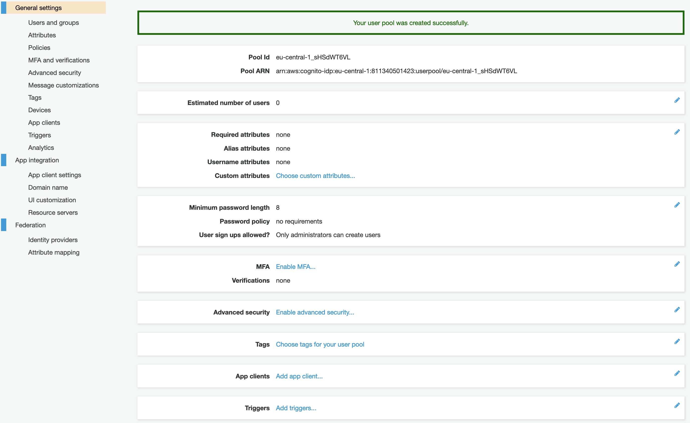
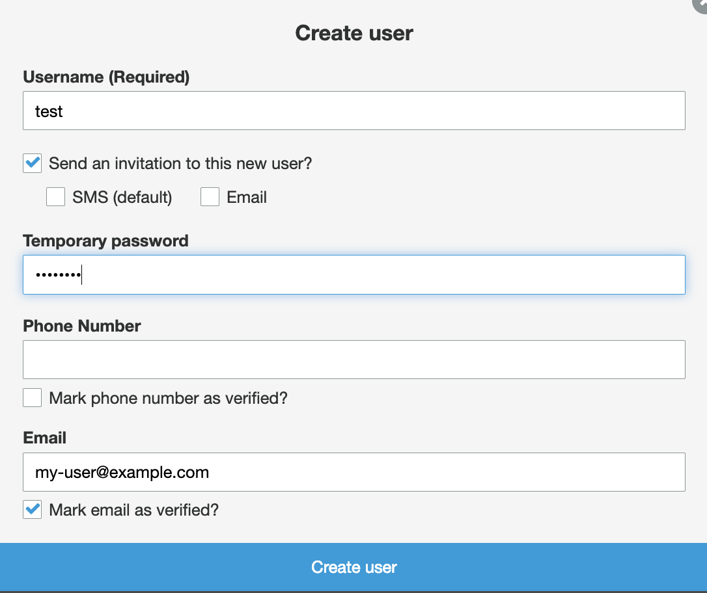

# Quickstart: BKPR on Amazon Elastic Container Service for Kubernetes (Amazon EKS)

## TOC

- [Introduction](#introduction)
- [Prerequisites](#prerequisites)
- [Installation and setup](#installation-and-setup)
- [Next steps](#next-steps)
  + [Installing Kubeapps on BKPR](kubeapps-on-bkpr.md)
- [Upgrading](#upgrading)
- [Teardown and cleanup](#teardown-and-cleanup)
- [Further reading](#further-reading)

## Introduction

This document walks you through setting up an Amazon Elastic Container Service for Kubernetes (Amazon EKS) cluster and installing the Bitnami Kubernetes Production Runtime (BKPR) on it.

## Prerequisites

* [Amazon AWS account](https://aws.amazon.com/)
* [Amazon CLI](https://aws.amazon.com/cli/)
* [`eksctl`](https://aws.amazon.com/blogs/opensource/eksctl-eks-cluster-one-command/)
* [Kubernetes CLI](https://kubernetes.io/docs/tasks/tools/install-kubectl/)
* [BKPR installer](install.md)
* [kubecfg](https://github.com/ksonnet/kubecfg/releases)
* [jq](https://stedolan.github.io/jq/)

### DNS requirements

In addition to the requirements listed above, a domain name is also required for setting up Ingress endpoints to services running in the cluster. The specified domain name can be a top-level domain (TLD) or a subdomain. In either case you have to manually [set up the NS records](#step-4-configure-domain-registration-records) for the specified TLD or subdomain so as to delegate DNS resolution queries to an Amazon Route 53 hosted zone created and managed by BKPR.  This is required in order to generate valid TLS certificates.

## Installation and setup

### Step 1: Set up the cluster

In this section, you will deploy an Amazon Elastic Container Service for Kubernetes (Amazon EKS) cluster using the `eksctl` tool.

* Make sure you have a working Amazon CLI environment. Refer to [Configuring the AWS CLI](https://docs.aws.amazon.com/cli/latest/userguide/cli-chap-configure.html) for more information.

* Configure the following environment variables:

  ```bash
  export BKPR_DNS_ZONE=my-domain.com
  export AWS_EKS_USER=my-user@example.com
  export AWS_EKS_CLUSTER=my-eks-cluster
  export AWS_EKS_K8S_VERSION=1.11
  ```

  - `BKPR_DNS_ZONE` specifies the DNS suffix for the externally-visible websites and services deployed in the cluster.
  - `AWS_EKS_USER` specifies the email address used in requests to Let's Encrypt.
  - `AWS_EKS_CLUSTER` specifies the name of the AKS cluster.
  - `AWS_EKS_K8S_VERSION` specifies the version of Kubernetes to use for creating the cluster. The [BKPR Kubernetes version support matrix](../README.md#kubernetes-version-support-matrix-for-bkpr) lists the base Kubernetes versions supported by BKPR.

* Create the EKS cluster:

  ```bash
  eksctl create cluster --name=${AWS_EKS_CLUSTER} \
                        --color=fabulous \
                        --nodes=3 \
                        --version=${AWS_EKS_K8S_VERSION}
  ```

  Provisioning an EKS cluster can take a long time to complete. Please be patient while the request is being processed.

* Configure `kubectl` to use the new cluster:

  ```bash
  aws eks update-kubeconfig --name=${AWS_EKS_CLUSTER}
  ```

* Verify that your cluster is up and running:

  ```bash
  kubectl get nodes
  ```

### Step 2: Configure a User Pool in AWS Cognito

In order to authenticate users for applications running atop EKS, BKPR requires a User Pool in AWS Cognito to be configured.

If you already have a working User Pool in AWS Cognito that you would like to use for authenticating users, you will need to retrieve its ID in the form `${AWS_REGION}-${USER_POOL_ID}`, and export it:

  ```bash
  export AWS_COGNITO_USER_POOL_ID=eu-central-1_sHSdWT6VL
  ```

And skip to the [Create user](#create-a-user) section below.

Else, If you are new to using BKPR on EKS, or if you want to create a new User Pool in AWS Cognito, please follow these steps:

1. Browse to the [Cognito](https://console.aws.amazon.com/cognito/) module in the AWS Console
2. Navigate to **Manage User Pools > Create a user pool**
3. Enter a valid **Pool name**, like `eks-test`, then on the **Step through settings** button
4. In the **Attributes** section leave all the checkboxes unticked as shown below and go to the **Next step**

<p align="center"></p>

5. In the **Policies** section leave all the checkboxes unticked and select **Only allow administrators to create users** as shown below and go to the **Next step**

<p align="center"></p>

6. In the **MFA and verifications** section select **No verification** as shown below and go to the **Next step**

<p align="center"></p>

7. In the **Message customizations** section do not change anything and click on the **Next step** button
8. In the **Tags** section you can add additional tags for your EKS cluster, if needed, then go to the **Next step**
9. In the **Devices** section do not change anything and click on the **Next step** button
10. In the **App clients** section do not change anything and click on the **Next step** button
11. In the **Triggers** section do not change anything and click on the **Next step** button
12. In the **Review** section you will see a quick summary of the user pool that will be created, like the onw shown below, and click on the **Create pool** button to create the user pool

<p align="center"></p>

13. The user pool will be created and the **General settings** page will be displayed, where you can find the User Pool ID and ARN:

<p align="center"></p>

Take note of the **Pool Id** and export its value:

  ```bash
  export AWS_COGNITO_USER_POOL_ID=eu-central-1_sHSdWT6VL
  ```

#### Create a user

In order to access protected resources which require authentication like Prometheus, Kibana or Grafana, you will need to configure users in the newly created user pool. The next steps highlight how to create a test user which can be used to access these protected resources:

1. Browse to the [Cognito](https://console.aws.amazon.com/cognito/) module in the AWS Console
1. Navigate to **Manage User Pools > YOUR_USER_POOL > Users and Groups > Create user**
1. Fill in the input fields as shown below:

<p align="center"></p>

Any time you are presented with an Amazon AWS authentication form, you can use this user to authenticate against protected resources in BKPR.

### Step 3: Deploy BKPR

To bootstrap your Kubernetes cluster with BKPR:

  ```bash
  kubeprod install eks \
    --email ${AWS_EKS_USER} \
    --dns-zone "${BKPR_DNS_ZONE}" \
    --user-pool-id "${AWS_COGNITO_USER_POOL_ID}"
  ```

Wait for all the pods in the cluster to enter `Running` state:

  ```bash
  kubectl get pods -n kubeprod
  ```

### Step 4: Configure domain registration records

BKPR creates and manages a DNS zone which is used to map external access to applications and services in the cluster. However, for it to be usable, you need to configure the NS records for the zone.

Query the name servers of the zone with the following command and configure the records with your domain registrar.

  ```bash
  BKPR_DNS_ZONE_ID=$(aws route53 list-hosted-zones-by-name --dns-name "${BKPR_DNS_ZONE}" \
                                                           --max-items 1 \
                                                           --query 'HostedZones[0].Id' \
                                                           --output text)
  aws route53 get-hosted-zone --id ${BKPR_DNS_ZONE_ID} --query DelegationSet.NameServers
  ```

Please note, it can take a while for the DNS changes to propagate.

### Step 5: Access logging and monitoring dashboards

After the DNS changes have propagated, you should be able to access the Prometheus and Kibana dashboards by visiting `https://prometheus.${BKPR_DNS_ZONE}` and `https://kibana.${BKPR_DNS_ZONE}` respectively.

Congratulations! You can now deploy your applications on the Kubernetes cluster and BKPR will help you manage and monitor them effortlessly.

## Next steps

- [Installing Kubeapps on BKPR](kubeapps-on-bkpr.md)

## Upgrading

### Step 1: Update the installer

Follow the [installation guide](install.md) to update the BKPR installer binary to the latest release.

### Step 2: Edit `kubeprod-manifest.jsonnet`

Edit the `kubeprod-manifest.jsonnet` file that was generated by `kubeprod install` and update the version referred in the `import` statement. For example, the following snippet illustrates the changes required in the `kubeprod-manifest.jsonnet` file if you're upgrading to version `v1.3.0` from version `v1.2.0`.

```diff
 // Cluster-specific configuration
-(import "https://releases.kubeprod.io/files/v1.2.0/manifests/platforms/eks.jsonnet") {
+(import "https://releases.kubeprod.io/files/v1.3.0/manifests/platforms/eks.jsonnet") {
  config:: import "kubeprod-autogen.json",
  // Place your overrides here
 }
```

### Step 3: Perform the upgrade

Re-run the `kubeprod install` command, from the [Deploy BKPR](#step-3-deploy-bkpr) step, in the directory containing the existing `kubeprod-autogen.json` and updated `kubeprod-manifest.jsonnet` files.

## Teardown and cleanup

### Step 1: Uninstall BKPR from your cluster

  ```bash
  kubecfg delete kubeprod-manifest.jsonnet
  ```

### Step 2: Delete the Hosted Zone in Route 53

  ```bash
  BKPR_DNS_ZONE_ID=$(aws route53 list-hosted-zones-by-name --dns-name "${BKPR_DNS_ZONE}" \
                                                           --max-items 1 \
                                                           --query 'HostedZones[0].Id' \
                                                           --output text)
  aws route53 list-resource-record-sets --hosted-zone-id \${BKPR_DNS_ZONE_ID} \
                                        --query '{ChangeBatch:{Changes:ResourceRecordSets[?Type != `NS` && Type != `SOA`].{Action:`DELETE`,ResourceRecordSet:@}}}' \
                                        --output json > changes

  aws route53 change-resource-record-sets --cli-input-json file://changes \
                                          --hosted-zone-id ${BKPR_DNS_ZONE_ID} \
                                          --query 'ChangeInfo.Id' \
                                          --output text

  aws route53 delete-hosted-zone --id ${BKPR_DNS_ZONE_ID} \
                                 --query 'ChangeInfo.Id' \
                                 --output text
  ```

  Additionally you should remove the NS entries configured at the domain registrar.

### Step 3: Delete the BKPR user

  ```bash
  ACCOUNT=$(aws sts get-caller-identity | jq -r .Account)
  aws iam detach-user-policy --user-name "bkpr-${BKPR_DNS_ZONE}" --policy-arn "arn:aws:iam::${ACCOUNT}:policy/bkpr-${BKPR_DNS_ZONE}"
  aws iam delete-policy --policy-arn "arn:aws:iam::${ACCOUNT}:policy/bkpr-${BKPR_DNS_ZONE}"
  ACCESS_KEY_ID=$(cat kubeprod-autogen.json | jq -r .externalDns.aws_access_key_id)
  aws iam delete-access-key --user-name "bkpr-${BKPR_DNS_ZONE}" --access-key-id "${ACCESS_KEY_ID}"
  aws iam delete-user --user-name "bkpr-${BKPR_DNS_ZONE}"
  ```

### Step 4: Delete the BKPR App Client

  ```bash
  USER_POOL=$(cat kubeprod-autogen.json | jq -r .oauthProxy.aws_user_pool_id)
  CLIENT_ID=$(cat kubeprod-autogen.json | jq -r .oauthProxy.client_id)
  aws cognito-idp delete-user-pool-client --user-pool-id "${USER_POOL}" --client-id "${CLIENT_ID}"
  ```

### Step 5: Delete the EKS cluster

  ```bash
  eksctl delete cluster --name ${AZURE_AKS_CLUSTER}
  ```

## Further reading

- [BKPR FAQ](FAQ.md)
- [Troubleshooting](troubleshooting.md)
