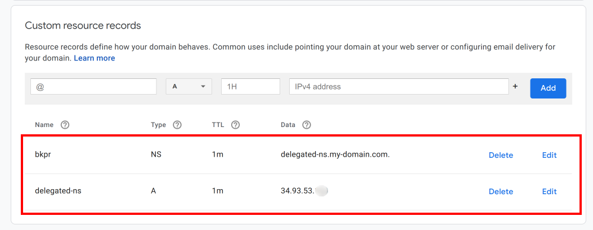

# Quickstart: BKPR on Generic Kubernetes Cluster (experimental)

## TOC

- [Introduction](#introduction)
- [Prerequisites](#prerequisites)
- [Installation and setup](#installation-and-setup)
- [Next steps](#next-steps)
  + [Installing Kubeapps on BKPR](kubeapps-on-bkpr.md)
- [Upgrading](#upgrading)
- [Teardown and cleanup](#teardown-and-cleanup)
- [Further reading](#further-reading)

## Introduction

This document walks you through installing the Bitnami Kubernetes Production Runtime (BKPR) on any kubernetes cluster which has `LoadBalancer` support.

## Prerequisites

* [Kubernetes CLI](https://kubernetes.io/docs/tasks/tools/install-kubectl/)
* [BKPR installer](install.md)
* [`kubecfg`](https://github.com/ksonnet/kubecfg/releases)
* [`jq`](https://stedolan.github.io/jq/)

### DNS requirements

In addition to the requirements listed above, a domain name is also required for setting up Ingress endpoints to services running in the cluster. The specified domain name can be a top-level domain (TLD) or a subdomain. In either case you have to manually [set up the NS records](#step-3-configure-domain-registration-records) for the specified TLD or subdomain so as to delegate DNS resolution queries to a PowerDNS zone created and managed by BKPR.  This is required in order to generate valid TLS certificates.

## Installation and setup

### Step 1: Set up the cluster

This article assumes you already have a Kubernetes cluster. The only requirement here is the Kubernetes cluster should be able to create `LoadBalancer` type services that have externally facing public IP addresses.

* Verify that your cluster is up and running:

  ```bash
  kubectl get nodes
  ```

### Step 2: Deploy BKPR

* Configure the following environment variables:

  ```bash
  export DNS_ZONE=my-domain.com
  export ADMIN_EMAIL=admin@my-domain.com
  export OAUTH_AUTHZ_DOMAIN="my-domain.com"
  export KEYCLOAK_PASSWORD="secretpassword"
  export KEYCLOAK_GROUP=""
  ```

  - `DNS_ZONE` specifies the DNS suffix for the externally-visible websites and services deployed in the cluster.
  - `ADMIN_EMAIL` specifies the email address used in LetsEncrypt requests
  - `OAUTH_AUTHZ_DOMAIN` specifies the email domain of authorized users
  - `KEYCLOAK_PASSWORD` specifies the admin password for the Keycloak server
  - `KEYCLOAK_GROUP` specifies the keycloak group of authorized users

To bootstrap your Kubernetes cluster with BKPR:

  ```bash
  kubeprod install generic \
    --dns-zone "${DNS_ZONE}" \
    --email "${ADMIN_EMAIL}" \
    --authz-domain "${OAUTH_AUTHZ_DOMAIN}" \
    --keycloak-password "${KEYCLOAK_PASSWORD}" \
    --keycloak-group "${KEYCLOAK_GROUP}"
  ```

Wait for all the pods in the cluster to enter `Running` state:

  ```bash
  kubectl get pods -n kubeprod
  ```

### Step 3: Configure domain registration records

BKPR creates and manages a DNS zone which is used to map external access to applications and services in the cluster. However, for it to be usable, you need to configure the NS records for the zone.

BKPR installs a PowerDNS server for creating and managing a delegated DNS zone. This DNS is accessible externally via the `nginx-ingress-udp` service running in the `kubeprod` namespace.

Execute the following command to get the IP address of the `nginx-ingress-udp` service and configure the records with your domain registrar.

  ```bash
  kubectl -n kubeprod get svc nginx-ingress-udp -o jsonpath='{.status.loadBalancer.ingress[0].ip}'
  ```

The following screenshot illustrates the NS record configuration on a DNS registrar when a subdomain is used.



Please note, it can take a while for the DNS changes to propagate.

### Step 4: Access dashboards

Login to the Keycloak server by visiting `https://id.${DNS_ZONE}/auth/admin/` and create users in the BKPR realm for who you would like to configure access to the BKPR services. These users should have email addresses that satisfy the authz domain restriction.

Users should now be able to authenticate with the Prometheus, Kibana, Grafana and PowerDNS dashboards by visiting `https://prometheus.${DNS_ZONE}`, `https://kibana.${DNS_ZONE}`, `https://grafana.${DNS_ZONE}` and `https://pdns.${DNS_ZONE}` respectively.

Congratulations! You can now deploy your applications on the Kubernetes cluster and BKPR will help you manage and monitor them effortlessly.

## Next steps

- [Installing Kubeapps on BKPR](kubeapps-on-bkpr.md)

## Upgrading

### Step 1: Update the installer

Follow the [installation guide](install.md) to update the BKPR installer binary to the latest release.

### Step 2: Edit `kubeprod-manifest.jsonnet`

Edit the `kubeprod-manifest.jsonnet` file that was generated by `kubeprod install` and update the version referred in the `import` statement. For example, the following snippet illustrates the changes required in the `kubeprod-manifest.jsonnet` file if you're upgrading to version `v1.1.0` from version `v1.0.0`.

```diff
 // Cluster-specific configuration
-(import "https://releases.kubeprod.io/files/v1.0.0/manifests/platforms/generic.jsonnet") {
+(import "https://releases.kubeprod.io/files/v1.1.0/manifests/platforms/generic.jsonnet") {
  config:: import "kubeprod-autogen.json",
  // Place your overrides here
 }
```

### Step 3: Perform the upgrade

Re-run the `kubeprod install` command, from the [Deploy BKPR](#step-2-deploy-bkpr) step, in the directory containing the existing `kubeprod-autogen.json` and updated `kubeprod-manifest.jsonnet` files.

## Teardown and cleanup

### Step 1: Uninstall BKPR from your cluster

  ```bash
  kubecfg delete kubeprod-manifest.jsonnet
  ```

### Step 2: Wait for the `kubeprod` namespace to be deleted

  ```bash
  kubectl wait --for=delete ns/kubeprod --timeout=300s
  ```

### Step 3: Delete the NS glue records

You should remove the NS entries configured at the domain registrar.

## Further reading

- [BKPR FAQ](FAQ.md)
- [Troubleshooting](troubleshooting.md)
