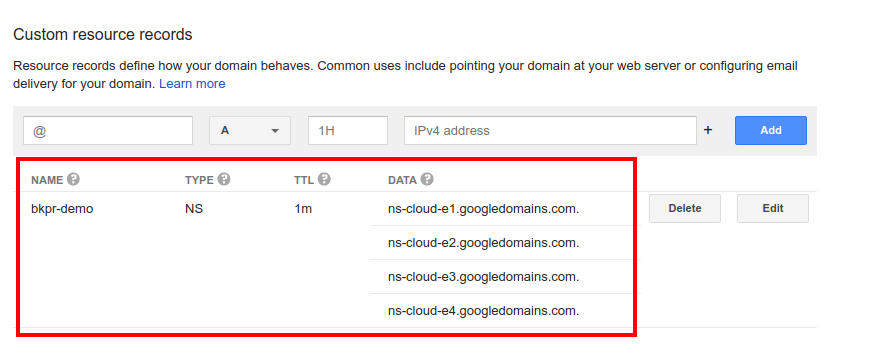

# Quickstart: BKPR on Google Kubernetes Engine (GKE)

## TOC

- [Introduction](#introduction)
- [Prerequisites](#prerequisites)
- [Installation and setup](#installation-and-setup)
- [Next steps](#next-steps)
  + [Installing Kubeapps on BKPR](kubeapps-on-bkpr.md)
- [Upgrading](#upgrading)
- [Teardown and cleanup](#teardown-and-cleanup)
- [Further reading](#further-reading)

## Introduction

This document walks you through setting up a Google Kubernetes Engine (GKE) cluster and installing the Bitnami Kubernetes Production Runtime (BKPR) on the cluster.

## Prerequisites

* [Google Cloud account](https://cloud.google.com/billing/docs/how-to/manage-billing-account)
* [Google Cloud Platform (GCP) project](https://cloud.google.com/resource-manager/docs/creating-managing-projects)
  + [Kubernetes Engine API](https://console.developers.google.com/apis/api/container.googleapis.com/overview) should be enabled
  + [Google Cloud DNS API](https://console.developers.google.com/apis/api/dns.googleapis.com/overview) should be enabled
* [Google Cloud SDK](https://cloud.google.com/sdk/)
* [Kubernetes CLI](https://kubernetes.io/docs/tasks/tools/install-kubectl/)
* [BKPR installer](install.md)
* [`kubecfg`](https://github.com/ksonnet/kubecfg/releases)
* [`jq`](https://stedolan.github.io/jq/)

### DNS and G Suite requirements

In addition to the requirements listed above, a domain name is also required for setting up Ingress endpoints to services running in the cluster. The specified domain name can be a top-level domain (TLD) or a subdomain. In either case you have to manually [set up the NS records](#configure-domain-registration-records) for the specified TLD or subdomain so as to delegate DNS resolution queries to a Google Cloud DNS zone created and managed by BKPR.

BKPR on GKE uses domain-based authorization, specified in `GCLOUD_AUTHZ_DOMAIN`, for verifying users as they login to the Elasticsearch, Kibana and Grafana dashboards. As such you need a [G Suite](https://gsuite.google.com/) account configured set up for your authorization domain to enable users to login with their G Suite user accounts.

## Installation and setup

### Step 1: Set up the cluster

In this section, you will deploy a Google Kubernetes Engine (GKE) cluster using the `gcloud` CLI.

* Authenticate the `gcloud` CLI with your Google Cloud account:

  ```bash
  gcloud auth login
  ```

* Set the Google Cloud application default credentials:

  ```bash
  gcloud auth application-default login
  ```

* Configure the following environment variables:

  ```bash
  export BKPR_DNS_ZONE="my-domain.com"
  export GCLOUD_USER="$(gcloud info --format='value(config.account)')"
  export GCLOUD_PROJECT="my-gce-project"
  export GCLOUD_ZONE="us-east1-d"
  export GCLOUD_AUTHZ_DOMAIN="my-domain.com"
  export GCLOUD_K8S_CLUSTER="my-gke-cluster"
  export GCLOUD_K8S_VERSION="1.11"
  ```

  - `BKPR_DNS_ZONE` specifies the DNS suffix for the externally-visible websites and services deployed in the cluster.
  - `GCLOUD_USER` specifies the email address used to authenticate to Google Cloud Platform.
  - `GCLOUD_PROJECT` specifies the Google Cloud project. `gcloud projects list` lists your Google Cloud projects.
  - `GCLOUD_ZONE` specifies the Google Cloud zone. `gcloud compute zones list` lists the Google Cloud zones.
  - `GCLOUD_AUTHZ_DOMAIN` specifies the email domain of authorized users and needs to be a [G Suite](https://gsuite.google.com/) domain.
  - `GCLOUD_K8S_CLUSTER` specifies the name of the GKE cluster.
  - `GCLOUD_K8S_VERSION` specifies the version of Kubernetes to use for creating the cluster. The [BKPR Kubernetes version support matrix](../README.md#kubernetes-version-support-matrix-for-bkpr-10) lists the base Kubernetes versions supported by BKPR. `gcloud container get-server-config --project ${GCLOUD_PROJECT} --zone ${GCLOUD_ZONE}` lists the versions available in your region.

* Create an OAuth Client ID by following these steps:

  1. Go to <https://console.developers.google.com/apis/credentials>.
  2. Select the project from the drop down menu.
  3. In the center pane, select the __OAuth consent screen__ tab.
  4. Enter a __Application name__ .
  5. Add the TLD of the domain specified in the `BKPR_DNS_ZONE` variable to the __Authorized domains__ and __Save__ the changes.
  6. Choose the __Credentials__ tab and select the __Create Credentials > OAuth client ID__ .
  7. Select the __Web application__ option and fill in a name.
  8. Finally, add the following redirect URIs and hit __Create__ .
      + https://prometheus.${BKPR_DNS_ZONE}/oauth2/callback
      + https://kibana.${BKPR_DNS_ZONE}/oauth2/callback
      + https://grafana.${BKPR_DNS_ZONE}/oauth2/callback

  > Replace `${BKPR_DNS_ZONE}` with the value of the `BKPR_DNS_ZONE` environment variable*

Specify the displayed OAuth client id and secret in the `GCLOUD_OAUTH_CLIENT_KEY` and `GCLOUD_OAUTH_CLIENT_SECRET` environment variables, for example:

  ```bash
  export GCLOUD_OAUTH_CLIENT_KEY="xxxxxxx.apps.googleusercontent.com"
  export GCLOUD_OAUTH_CLIENT_SECRET="xxxxxx"
  ```

* Set the default project:

  ```bash
  gcloud config set project ${GCLOUD_PROJECT}
  ```

* Set the default region:

  ```bash
  gcloud config set compute/zone ${GCLOUD_ZONE}
  ```

* Create the GKE cluster:

  ```bash
  gcloud container clusters create ${GCLOUD_K8S_CLUSTER} \
    --project ${GCLOUD_PROJECT} \
    --num-nodes 3 \
    --machine-type n1-standard-2 \
    --zone ${GCLOUD_ZONE} \
    --cluster-version ${GCLOUD_K8S_VERSION}
  ```

* Create a `cluster-admin` role binding:

  ```bash
  kubectl create clusterrolebinding cluster-admin-binding \
    --clusterrole=cluster-admin \
    --user=${GCLOUD_USER}
  ```

### Step 2: Deploy BKPR

To bootstrap your Kubernetes cluster with BKPR:

  ```bash
  kubeprod install gke \
    --email "${GCLOUD_USER}" \
    --dns-zone "${BKPR_DNS_ZONE}" \
    --project "${GCLOUD_PROJECT}" \
    --oauth-client-id "${GCLOUD_OAUTH_CLIENT_KEY}" \
    --oauth-client-secret "${GCLOUD_OAUTH_CLIENT_SECRET}" \
    --authz-domain "${GCLOUD_AUTHZ_DOMAIN}"
  ```

Wait for all the pods in the cluster to enter `Running` state:

  ```bash
  kubectl get pods -n kubeprod
  ```

If you want to bootstrap the cluster from scratch after a failed run, you should remove `kubeprod-manifest.jsonnet` file.

#### Warning

The `kubeprod-autogen.json` file stores sensitive information. Do not commit this file in a GIT repository.

### Step 3: Configure domain registration records

BKPR creates and manages a Cloud DNS zone which is used to map external access to applications and services in the cluster. However, for it to be usable, you need to configure the NS records for the zone.

Query the name servers of the zone with the following command and configure the records with your domain registrar.

  ```bash
  BKPR_DNS_ZONE_NAME=$(gcloud dns managed-zones list --filter dnsName:${BKPR_DNS_ZONE} --format='value(name)')
  gcloud dns record-sets list \
    --zone ${BKPR_DNS_ZONE_NAME} \
    --name ${BKPR_DNS_ZONE} --type NS \
    --format=json | jq -r .[].rrdatas
  ```

The following screenshot illustrates the NS record configuration on a DNS registrar when a subdomain is used.



Please note, it can take a while for the DNS changes to propogate.

### Step 4: Access logging and monitoring dashboards

After the DNS changes have propagated, you should be able to access the Prometheus, Kibana and Grafana dashboards by visiting `https://prometheus.${BKPR_DNS_ZONE}`, `https://kibana.${BKPR_DNS_ZONE}` and `https://grafana.${BKPR_DNS_ZONE}` respectively.

> Replace `${BKPR_DNS_ZONE}` with the value of the `BKPR_DNS_ZONE` environment variable*

Congratulations! You can now deploy your applications on the Kubernetes cluster and BKPR will help you manage and monitor them effortlessly.

## Next steps

- [Installing Kubeapps on BKPR](kubeapps-on-bkpr.md)

## Upgrading

### Step 1: Update the installer

Follow the [installation guide](install.md) to update the BKPR installer binary to the latest release.

### Step 2: Edit `kubeprod-manifest.jsonnet`

Edit the `kubeprod-manifest.jsonnet` file that was generated by `kubeprod install` and update the version referred in the `import` statement. For example, the following snippet illustrates the changes required in the `kubeprod-manifest.jsonnet` file if you're upgrading to version `v1.1.0` from version `v1.0.0`.

```diff
 // Cluster-specific configuration
-(import "https://releases.kubeprod.io/files/v1.0.0/manifests/platforms/gke.jsonnet") {
+(import "https://releases.kubeprod.io/files/v1.1.0/manifests/platforms/gke.jsonnet") {
  config:: import "kubeprod-autogen.json",
  // Place your overrides here
 }
```

### Step 3: Perform the upgrade

Re-run the `kubeprod install` command, from the [Deploy BKPR](step-2-deploy-bkpr) step, in the directory containing the existing `kubeprod-autogen.json` and updated `kubeprod-manifest.jsonnet` files.

## Teardown and cleanup

### Step 1: Uninstall BKPR from your cluster

  ```bash
  kubecfg delete kubeprod-manifest.jsonnet
  ```

### Step 2: Wait for the `kubeprod` namespace to be deleted

  ```bash
  kubectl wait --for=delete ns/kubeprod --timeout=300s
  ```

### Step 3: Delete the Cloud DNS zone

  ```bash
  BKPR_DNS_ZONE_NAME=$(gcloud dns managed-zones list --filter dnsName:${BKPR_DNS_ZONE} --format='value(name)')
  gcloud dns record-sets import /dev/null --zone ${BKPR_DNS_ZONE_NAME} --delete-all-existing
  gcloud dns managed-zones delete ${BKPR_DNS_ZONE_NAME}
  ```

### Step 4: Delete service account and IAM profile

  ```bash
  GCLOUD_SERVICE_ACCOUNT=$(gcloud iam service-accounts list --filter "displayName:${BKPR_DNS_ZONE} AND email:bkpr-edns" --format='value(email)')
  gcloud projects remove-iam-policy-binding ${GCLOUD_PROJECT} \
    --member=serviceAccount:${GCLOUD_SERVICE_ACCOUNT} \
    --role=roles/dns.admin
  gcloud iam service-accounts delete ${GCLOUD_SERVICE_ACCOUNT}
  ```

### Step 5: Delete the GKE cluster

  ```bash
  gcloud container clusters delete ${GCLOUD_K8S_CLUSTER}
  ```

## Further reading

- [BKPR FAQ](FAQ.md)
- [Troubleshooting](troubleshooting.md)
