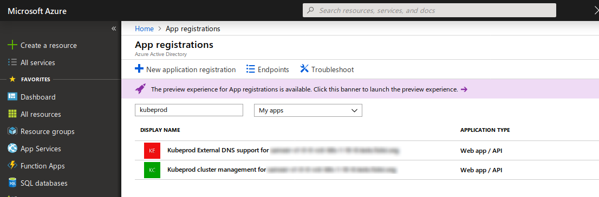

# Troubleshooting Guide

## Index

- [Troubleshooting AKS cluster creation](#troubleshooting-aks-cluster-creation)
    + [Service principal clientID not found](#service-principal-clientid-not-found)
- [Troubleshooting BKPR installation](#troubleshooting-bkpr-installation)
    + [Object with the same value for property exists](#object-with-the-same-value-for-property-exists)
- [Troubleshooting BKPR Ingress](#troubleshooting-bkpr-ingress)
    + [Let's Encrypt](#lets-encrypt)
- [Troublehooting DNS](#troubleshooting-dns)
    + [Unable to resolve DNS addresses](#unable-to-resolve-dns-addresses)
    + [ExternalDNS pods are not starting](#externaldns-pods-are-not-starting)
    + [ExternalDNS is not updating DNS zone records](#externaldns-is-not-updating-dns-zone-records)
    + [DNS glue records are not configured](#dns-glue-records-are-not-configured)
    + [DNS propagation has not completed](#dns-propagation-has-not-completed)

## Troubleshooting AKS cluster creation

### Service principal clientID not found

If you notice the following error message from `az aks create`, it could indicate the Azure authentication token has expired.

```
Operation failed with status: 'Bad Request'. Details: Service principal clientID: <REDACTED>
not found in Active Directory tenant <REDACTED>, Please see https://aka.ms/acs-sp-help for more details.
```

__Troubleshooting__:

Please clear your Azure profile directory with `rm -rf ~/.azure` and retry after logging in again.

## Troubleshooting BKPR installation

### Object with the same value for property exists

__[Reported in issue #242](https://github.com/bitnami/kube-prod-runtime/issues/242)__

While installing BKPR on an AKS cluster, if you notice the following error message from `kubeprod install`, it indicates that another Azure service principal with the same value exists.

```
ERROR Error: graphrbac.ApplicationsClient#Create: Failure responding to request: StatusCode=400 -- Original Error: autorest/azure: Service returned an error. Status=400 Code="Unknown" Message="Unknown service error" Details=[{"odata.error":{"code":"Request_BadRequest","date":"2018-11-29T00:31:52","message":{"lang":"en","value":"Another object with the same value for property identifierUris already exists."},"requestId":"3c6f59e9-ad05-42fb-8ab2-3a9745eb9f68","values":[{"item":"PropertyName","value":"identifierUris"},{"item":"PropertyErrorCode","value":"ObjectConflict"}]}}]
```

__Troubleshooting__:

This is typically encountered when you attempt to install BKPR with a DNS zone (`--dns-zone`) that was used in an earlier installation on BKPR. Login to the [Azure Portal](https://portal.azure.com) and navigate to __Azure Active Directory > App registrations__ and filter the result with the keyword `kubeprod`. From the filtered results remove the entries that have the BKPR DNS zone in its name and retry the BKPR installation.



## Troubleshooting BKPR ingress

### Let's Encrypt

BKPR deploys [`cert-manager`](#components.md/cert-manager) Kubernetes add-on to automate the management and issuance of TLS certificates. `cert-manager` delegates on Let's Encrypt to retrieve valid X.509 certificates used to protect designated Kubernetes ingress resources with TLS encryption for HTTP traffic.

A Kubernetes ingress resource is designated to be TLS-terminated at the NGINX controller when the following annotations are present:

```
Annotations:
  kubernetes.io/ingress.class:                        nginx
  kubernetes.io/tls-acme:                             true
```

`cert-manager` watches for Kubernetes ingress resources. When an ingress resource with the `"kubernetes.io/tls-acme": true` annotation is seen for the first time, `cert-manager` tries to issue an [ACME certificate using HTTP-01 challenge](http://docs.cert-manager.io/en/latest/tutorials/acme/http-validation.html). This works by creating a temporary ingress resource name like `cm-acme-http-solver-${pod_id}` and then triggering the HTTP-01 challenge protocol. This requires that Let's Encrypt is able to resolve the DNS name associated with the Kubernetes ingress resource. On a Kubernetes cluster where BKPR is deployed, this requires that External DNS is functioning properly.

During the time while `cert-manager` negotiates the certificate issue with Let's Encrypt, NGNIX controller temporatily uses a self-signed certificate. This situation should be transient and when it lasts for more than a couple of minutes there is a problem that prevents the certificate from being issued. Please note that when using the staging environment for Let's Encrypt the certificates issued by it not be recognized as valid (the signing CA is not a recognized one). 

When everything works as expected, `cert-manager` will eventually install the certificate as seen next (example):

```
$ kubectl describe certificate example-com
Events:
  Type    Reason          Age      From          Message
  ----    ------          ----     ----          -------
  Normal  CreateOrder     57m      cert-manager  Created new ACME order, attempting validation...
  Normal  DomainVerified  55m      cert-manager  Domain "example.com" verified with "http-01" validation
  Normal  DomainVerified  55m      cert-manager  Domain "www.example.com" verified with "http-01" validation
  Normal  IssueCert       55m      cert-manager  Issuing certificate...
  Normal  CertObtained    55m      cert-manager  Obtained certificate from ACME server
  Normal  CertIssued      55m      cert-manager  Certificate issued successfully
```

If this is not the case, Let's Encrypt will refuse to issue the certificate. Besides having NGINX serve a self-signed certificate, this is typically signalled because there are temporary Kubernetes ingress resources named like `cm-acme-http-solver-${pod_id}` lingering around for a while. At some point, certificate generation will time-out, these temporary ingress resources will be destroyed and the Kubernetes certificate will be marked accordingly in its events section. Make sure that External DNS is working properly. Let's Encrypt requires that the DNS name (subject) of the X.509 certificate can resolve properly. Please read the section about troubleshooting DNS and External DNS in this document.

## Troublehooting DNS

### Unable to resolve DNS addresses

You have installed BKPR to your Kubernetes cluster, but are unable to access any of the Ingress endpoints due to DNS resolution errors.

```bash
ping prometheus.my-domain.com
ping: prometheus.my-domain.com: Name or service not known
```

__Troubleshooting__:

DNS address resolution could be a result of configuration issues. For a working DNS setup you need to ensure all of the following conditions are met.

- [ExternalDNS Pods are running](#externaldns-pods-are-not-starting)
- [ExternalDNS is updating DNS zone records](#externaldns-is-not-updating-dns-zone-records)
- [DNS glue records are configured](#dns-glue-records-are-not-configured)
- [DNS propagation has completed](#dns-propagation-has-not-completed)

### ExternalDNS Pods are not starting

Use the following command to check the status of the `external-dns` deployment:

```bash
kubectl -n kubeprod get deployments external-dns
NAME           DESIRED   CURRENT   UP-TO-DATE   AVAILABLE   AGE
external-dns   1         1         1            0           5m
```

The `AVAILABLE` column indicates the number of Pods that have started successfully.

__Troubleshooting__:

A Pod goes through various [lifecyle phases](https://kubernetes.io/docs/concepts/workloads/pods/pod-lifecycle/) before it enters the `Running` phase. You can use the following command to watch the rollout status of the `external-dns` Deployment:

```bash
kubectl -n kubeprod rollout status deployments external-dns
Waiting for deployment "external-dns" rollout to finish: 0 of 1 updated replicas are available...
Waiting for deployment "external-dns" rollout to finish: 1 of 1 updated replicas are available...
```

The command will return with the message `deployment "external-dns" successfully rolled out` after all the Pods in the `external-dns` Deployment have started successfully. Please note it could take a few minutes for the `external-dns` Deployment to complete.

If it takes an abnormally long time (>5m) for the `external-dns` Pods to enter the `Running` phase, they may have encountered an error condition.

Check the status of the `external-dns` Pods with the command:

```bash
kubectl -n kubeprod get $(kubectl -n kubeprod get pods -l name=external-dns -o name)
NAME                            READY   STATUS              RESTARTS   AGE
external-dns-7bfbf596dd-55ngz   0/1     CrashLoopBackOff    3          10m
```

The `STATUS` column indicates the state the Pod is currently in and the `RESTARTS` column indicates the number of times the Pod has been restarted.

In the sample output you can see that the `external-dns` Pod is in the `CrashLoopBackOff` state and has been restarted very frequently indicating it has been encountering some error condition. In such situations you should inspect the details of the pod with the command:

```bash
kubectl -n kubeprod describe $(kubectl -n kubeprod get pods -l name=external-dns -o name)
```

Additionally, the container logs may contain useful information about the error condition. Inspect the container logs using the following command:

```bash
kubectl -n kubeprod logs $(kubectl -n kubeprod get pods -l name=external-dns -o name)
```

If you are unable to determine the cause of the error, [create a support request](https://github.com/bitnami/kube-prod-runtime/issues/new) describing your environment and remember to attach the output of the last two commands to the support request.

### ExternalDNS is not updating DNS zone records

The DNS host records (__A__) can be listed using the following command:

On Google Cloud Platform:

```bash
gcloud dns record-sets list --zone $(gcloud dns managed-zones list --filter dnsName:${BKPR_DNS_ZONE} --format='value(name)') --filter type=A
```

On Microsoft Azure:

```bash
az network dns record-set list --resource-group ${AZURE_RESOURCE_GROUP} --zone-name ${BKPR_DNS_ZONE} --query "[?arecords!=null]" --output table
```

BKPR, by default, creates host records for Prometheus, Grafana and Kibana dashboards. These records should be listed in the output of the above command.

__Troubleshooting__:

ExternalDNS automatically manages host records for Ingress resources in the cluster. When an Ingress resource is created, it could take a few minutes for it to be seen by ExternalDNS.

If the records are not updated a few minutes after the Ingress resource is created, use the following command to inspect the container logs of the `external-dns` Pod to discover any error conditions that may have been encountered.

```bash
kubectl -n kubeprod logs $(kubectl -n kubeprod get pods -l name=external-dns -o name)
```

### DNS glue records are not configured

The DNS glue record setup is the most basic requirement for the DNS address resolution to work correctly. The glue records are typically configured at the DNS domain registrar.

Use the following command to query the glue record configuration for your domain:

```bash
dig ${BKPR_DNS_ZONE} NS +noall +answer
```

The command should list one or more Nameserver (__NS__) records configured for your domain.

__Troubleshooting__:

If the above listed command does not return any __NS__ records, it indicates that the DNS glue records have not been configured at your domain registrar. At the same time, it is also possible the glue records are configured with wrong values.

First, use the following command to query the values of the NS records that should be set up as glue records.

On Google Cloud Platform:

```bash
gcloud dns managed-zones describe \
  $(gcloud dns managed-zones list --filter dnsName:${BKPR_DNS_ZONE} --format='value(name)')
```

On Microsoft Azure:

```bash
az network dns zone show \
  --name ${BKPR_DNS_ZONE} \
  --resource-group ${AZURE_RESOURCE_GROUP} \
  --query nameServers \
  --output table
```

Next, use your domain registrar's portal to add __NS__ records for your domain with the values displayed in the output of the previous command.

### DNS propagation has not completed

Nameserver changes typically take 0 to 24 hours to take effect, but they may also take as long as 48 hours.

__Troubleshooting__:

If [ExternalDNS is updating DNS zone records](#externaldns-is-not-updating-dns-zone-records) and the [DNS glue records are configured](#dns-glue-records-are-not-configured) correctly, you need to wait for the DNS propagation to complete.

[whatsmydns.net](https://www.whatsmydns.net) is a DNS propagation checker that can give you a rough idea of the DNS propagation status of your DNS records.

## Troubleshooting BKPR ingress

### Let's Encrypt

BKPR deploys [`cert-manager`](#components.md/cert-manager) Kubernetes add-on to automate the management and issuance of TLS certificates. `cert-manager` delegates on Let's Encrypt to retrieve valid X.509 certificates used to protect designated Kubernetes ingress resources with TLS encryption for HTTP traffic.

A Kubernetes ingress resource is designated to be TLS-terminated at the NGINX controller when the following annotations are present:

```
Annotations:
  kubernetes.io/ingress.class:                        nginx
  kubernetes.io/tls-acme:                             true
```

`cert-manager` watches for Kubernetes ingress resources. When an ingress resource with the `"kubernetes.io/tls-acme": true` annotation is seen for the first time, `cert-manager` tries to issue an [ACME certificate using HTTP-01 challenge](http://docs.cert-manager.io/en/latest/tutorials/acme/http-validation.html). This works by creating a temporary ingress resource name like `cm-acme-http-solver-${pod_id}` and then triggering the HTTP-01 challenge protocol. This requires that Let's Encrypt is able to resolve the DNS name associated with the Kubernetes ingress resource. On a Kubernetes cluster where BKPR is deployed, this requires that External DNS is functioning properly.

During the time while `cert-manager` negotiates the certificate issue with Let's Encrypt, NGNIX controller temporatily uses a self-signed certificate. This situation should be transient and when it lasts for more than a couple of minutes there is a problem that prevents the certificate from being issued. Please note that when using the staging environment for Let's Encrypt the certificates issued by it not be recognized as valid (the signing CA is not a recognized one). 

When everything works as expected, `cert-manager` will eventually install the certificate as seen next (example):

```
$ kubectl describe certificate example-com
Events:
  Type    Reason          Age      From          Message
  ----    ------          ----     ----          -------
  Normal  CreateOrder     57m      cert-manager  Created new ACME order, attempting validation...
  Normal  DomainVerified  55m      cert-manager  Domain "example.com" verified with "http-01" validation
  Normal  DomainVerified  55m      cert-manager  Domain "www.example.com" verified with "http-01" validation
  Normal  IssueCert       55m      cert-manager  Issuing certificate...
  Normal  CertObtained    55m      cert-manager  Obtained certificate from ACME server
  Normal  CertIssued      55m      cert-manager  Certificate issued successfully
```

If this is not the case, Let's Encrypt will refuse to issue the certificate. Besides having NGINX serve a self-signed certificate, this is typically signalled because there are temporary Kubernetes ingress resources named like `cm-acme-http-solver-${pod_id}` lingering around for a while. At some point, certificate generation will time-out, these temporary ingress resources will be destroyed and the Kubernetes certificate will be marked accordingly in its events section. Make sure that External DNS is working properly. Let's Encrypt requires that the DNS name (subject) of the X.509 certificate can resolve properly. Please read the section about troubleshooting DNS and External DNS in this document.
